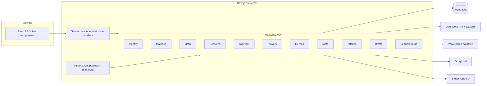

<div align="center">

# Dota Den

**A Dota 2 companion for players who want honest answers about their own games, and a place to practise drafting that feels like a real captain across the table.**

[](https://github.com/thisisdajaaa/dota-den/actions/workflows/ci-cd.yml)


[Production](https://dota-den.vercel.app) · [Staging](https://dota-den-develop.vercel.app) · [Docs](docs/README.md) · [Decisions (ADRs)](docs/adr)

</div>

---

## Contents

- [What it is](#what-it-is)
- [Features](#features)
- [Honesty principles](#honesty-principles)
- [Architecture](#architecture)
- [Tech stack](#tech-stack)
- [Getting started](#getting-started)
- [Scripts](#scripts)
- [Testing](#testing)
- [Deployment](#deployment)
- [Configuration](#configuration)
- [Data sources and attribution](#data-sources-and-attribution)
- [Project structure](#project-structure)
- [Contributing](#contributing)
- [License](#license)

## What it is

Sign in with Steam and Dota Den pulls your public match history from OpenDota, keeps it in sync, and turns it into
pages you can actually use: your record and form, your heroes, who you play with, how your sessions went, what the
latest patch changed for you. Everything is built in-app, with no bouncing out to other sites for match data.

The drafting side is a full Captain's Mode trainer: draft against an AI captain grounded in current high-rank and
tournament data, draft live against a friend, or solve short drafting puzzles, and get a report card on every draft.

## Features

### Your games

- **Steam sign-in.** OpenID with rotating, server-side sessions ([ADR 0001](docs/adr/0001-steam-openid-and-sessions.md)).
- **Auto-synced match history.** Imports your public matches (first sync backfills, later syncs are incremental), with
  in-app match pages: scoreboard, gold and XP graphs, items, and every player's rank where known.
- **MMR journal.** Log your MMR when you see it. A change is shown as exact only when two entries bracket exactly the
  ranked games in between; otherwise it's labelled an estimate with the reason
  ([ADR 0007](docs/adr/0007-mmr-attribution.md)).
- **Session recaps and goals.** Back-to-back games are grouped into sessions (your choice of break: 30 to 120 minutes)
  with a recap, streaks, best and worst game, and a note and goal you can mark as met.
- **Heroes.** A page per hero you've played: record, KDA, GPM/XPM, win-rate trend by patch or month, who you beat and
  lose to, your most-bought items, and the public high-rank win rate for comparison. Plus a lane and position
  breakdown of where you actually play.

### People

- **Player search and tracking.** Find players by name or ID, open their profiles, track friends.
- **Together.** Who you play with, win rate together versus your usual, rivals, and duo and trio pages. A game counts
  as "together" only when OpenDota reports a shared party; same team without party data is shown as unknown, never
  guessed.
- **Leaderboards.** Separate boards for draft games, draft challenges and friend rooms, for your friends or everyone,
  this week or all time. The Everyone boards only list players who opt in (profiles are private by default).

### The game

- **Meta by role.** For each position, the heroes doing well right now at high ranks, lane win rates, tournament picks
  and bans, rising and falling heroes, and the strongest lane duos in pro games.
- **Patch notes in-app**, from Valve's own feed, plus what the latest patch changed for _your_ heroes.

### Drafting

- **Draft vs an AI captain** in Captain's Mode (current 7.40 order, timers and reserve time, verified against the
  patch notes; [ADR 0005](docs/adr/0005-draft-rulesets.md)). The AI ranks every legal option with data (see below)
  and a language model chooses among the top candidates and explains why; if the model is unavailable it falls back
  to the top-ranked option.
- **Five positions.** Every hero is placed at carry, mid, offlane, soft support or hard support from where pros play it
  (last 60 days), suggestions offer the best hero for each open position, and you can change who plays where.
- **Lanes and matchups.** Pro lane results (who had more gold at 10 minutes when two heroes met in lane), whole-game
  head-to-heads measured against what win rates predict, tournament priority, and pro pairings.
- **Draft outlook.** An estimated win chance from the draft alone, with the evidence behind it. Its weights are fitted
  to real games: on 3,000 recent ranked Divine+ games it wasn't fitted on, it picked the winner **57.0%** of the time,
  against 54.6% for always picking Radiant. Drafts decide only part of a game, so the estimate stays between 30% and 70%.
- **Report card.** Each side graded on lanes, counters, composition, hero strength, positions and combos, weighted
  half by our prior and half by the fit to real games.
- **AI review.** On request, a language model reviews the finished draft (win conditions, timing, combos, key
  matchups) from each hero's current abilities and our numbers. It can nudge only two grades, by at most 8 points,
  with a reason; the data grades stay the source of truth.
- **Draft challenges.** Last pick, counter pick, ban priority and opening bans, graded against the same data, with
  streaks.
- **Draft with a friend.** Live rooms with two captains and spectators, server-refereed turns, rematches, and a
  permanent history per friend ([ADR 0003](docs/adr/0003-multiplayer-draft-transport.md)).

More detail: [docs/draft-engine.md](docs/draft-engine.md).

## Honesty principles

- Never fabricate MMR, party membership or win probabilities.
- A missing `party_size` means **unknown**, never solo.
- Estimates are always labelled as estimates, with their basis and sample sizes.
- Small samples are damped toward even, and anything below a minimum sample says "too few games to judge".

## Architecture

A modular monolith on Next.js 16 (App Router). Each bounded context lives in `src/modules/<context>` with
`domain → application → infrastructure → ui` layers and a `composition.ts` that wires them. The layer rules are
enforced by a test ([ADR 0004](docs/adr/0004-module-boundaries.md)).



See [docs/architecture.md](docs/architecture.md) for the data flows (match sync, the draft AI, rooms, caching).

## Tech stack

| Area      | Choice                                                                                  |
| --------- | --------------------------------------------------------------------------------------- |
| Framework | Next.js 16 (App Router, Turbopack), React 19                                            |
| Language  | TypeScript (strict)                                                                     |
| UI        | Tailwind CSS 4, shadcn/ui (Radix), lucide icons                                         |
| Forms     | React Hook Form + Zod                                                                   |
| Data      | MongoDB (official driver)                                                               |
| Upstreams | OpenDota API and explorer, Valve patch datafeed, Steam OpenID, Groq (OpenAI-compatible) |
| Tests     | Vitest (unit, component, integration), Playwright (E2E)                                 |
| Delivery  | GitHub Actions → Vercel (staging and production)                                        |

## Getting started

**Prerequisites:** Node 22 (see `.nvmrc`), and a MongoDB you can reach (local `mongod` or Atlas).

```bash
git clone https://github.com/thisisdajaaa/dota-den.git
cd dota-den
npm ci
cp .env.example .env.local   # then set APP_URL and MONGODB_URI at least
npm run db:indexes           # create collections' indexes
npm run dev                  # http://localhost:3000
```

Signing in locally needs a real Steam login at `APP_URL`. For development without Steam, set `AUTH_TEST_MODE=true`
in `.env.local` to use a fake identity provider (it is refused in production).

Optional keys: `OPENDOTA_API_KEY` (higher OpenDota limits) and `GROQ_API_KEY` (the AI captain's language model and the
AI review). See [docs/data-sources.md](docs/data-sources.md) for how to get them.

## Scripts

| Script                        | What it does                                                                                    |
| ----------------------------- | ----------------------------------------------------------------------------------------------- |
| `npm run dev`                 | Start the dev server                                                                            |
| `npm run build` / `npm start` | Production build and server                                                                     |
| `npm run check`               | Format check, lint, typecheck, unit + component tests, integration tests                        |
| `npm test`                    | Unit and component tests                                                                        |
| `npm run test:integration`    | Integration tests against MongoDB (`MONGODB_TEST_URI`)                                          |
| `npm run test:e2e`            | Playwright end-to-end tests                                                                     |
| `npm run db:indexes`          | Create or update all MongoDB indexes (idempotent)                                               |
| `npm run draft:calibrate`     | Refit the draft outlook's weights on recent games ([details](docs/draft-engine.md#calibration)) |

## Testing

- **Unit and component** (Vitest): domain rules, services with fakes, UI components. Includes the architecture test
  that enforces module boundaries.
- **Integration** (Vitest + MongoDB at `MONGODB_TEST_URI`, default `mongodb://127.0.0.1:27017`): repositories, unique
  indexes and concurrency.
- **End-to-end** (Playwright): the real app against a fixture OpenDota/Valve server with synthetic data
  (`tests/e2e/support/opendota-fixture-server.mjs`), including a phone-width suite. Run one Playwright suite at a time;
  on a laptop, `--workers=2` is a good default.

## Deployment

| Branch    | Environment | URL                                 |
| --------- | ----------- | ----------------------------------- |
| `develop` | Staging     | https://dota-den-develop.vercel.app |
| `main`    | Production  | https://dota-den.vercel.app         |

Feature branches merge into `develop`; releases merge `develop` into `main`. GitHub Actions
(`.github/workflows/ci-cd.yml`) runs lint, typecheck, tests and build, then the E2E suite, then deploys a prebuilt
bundle to Vercel, applies database indexes, and smoke-tests the deployment. Each environment is a protected GitHub
environment with its own secrets. Details: [docs/operations.md](docs/operations.md).

## Configuration

All configuration is environment variables, validated at startup (`src/lib/env.ts`). The required ones are
`APP_URL` and `MONGODB_URI`; everything else has a safe default or turns a feature off. The full reference, including
operator tuning (rate limits, room caps, caches, timeouts) and the optional Redis and background-job settings, is in
[docs/configuration.md](docs/configuration.md). `.env.example` lists every variable with its default.

## Data sources and attribution

- Match, player and hero data: [OpenDota](https://www.opendota.com) (API and SQL explorer).
- Patch notes: Valve's official Dota 2 datafeed, linked to the official source.
- Language model: [Groq](https://groq.com), OpenAI-compatible API.
- Sign-in: Steam OpenID.

Dota Den is an unofficial fan project. It is not affiliated with or endorsed by Valve Corporation. Dota 2 is a
registered trademark of Valve Corporation.

## Project structure

```
src/
  app/                 Routes: (public) and (app) pages, api/ route handlers
  components/          Shared UI (layout, shadcn/ui primitives)
  lib/                 Env, HTTP helpers, logging, rate limiting, MongoDB client
  modules/<context>/   domain/ application/ infrastructure/ ui/ composition.ts
scripts/               Index setup, draft calibration
tests/
  unit/ component/ integration/ e2e/
docs/                  Architecture, configuration, API, draft engine, data sources, operations, ADRs
```

## Contributing

- Branch from `develop` (`feature/<name>` or `fix/<name>`) and open a pull request into `develop`.
- `npm run check`, `npm run build` and the E2E suite must pass.
- Keep domain code pure; wire dependencies in `composition.ts`. Record significant decisions as an ADR in `docs/adr`.
- Commit messages: a short summary line (`Area: what changed`), then the why.

## License

No license yet: all rights reserved by the author until one is added.
